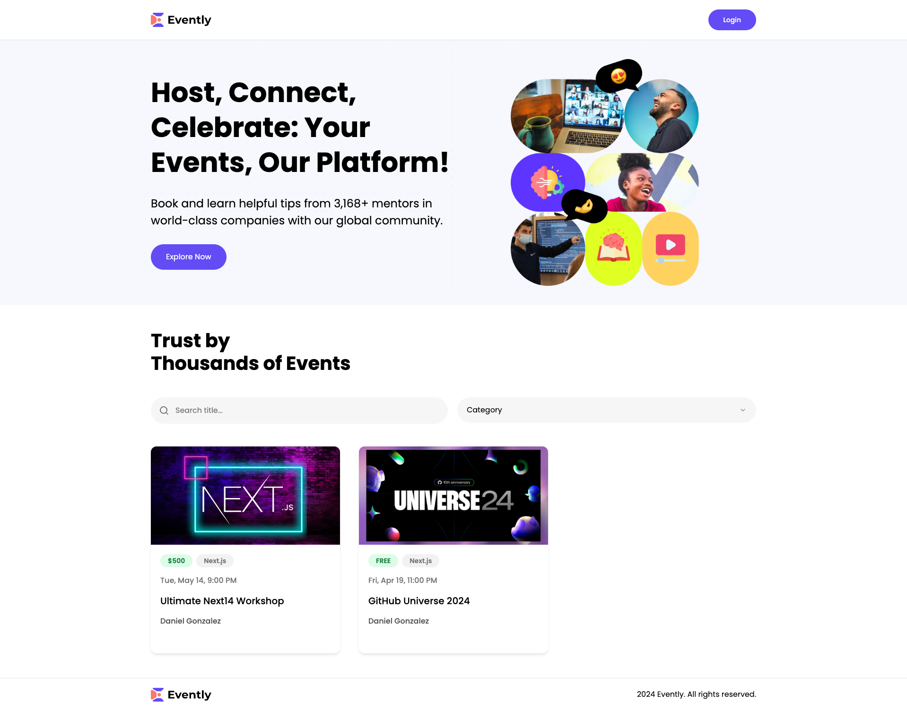

  

    
    
    
    
  

  <h1 align="center">A Full Stack Next 14 Events App</h3>

## 📋 <a name="table">Table of Contents</a>

1. 🤖 [Introduction](#introduction)
2. ⚙️ [Tech Stack](#tech-stack)
3. 🔋 [Features](#features)

## <a name="introduction">🤖 Introduction</a>

Built on Next.js 14, the events application stands as a comprehensive, full-stack platform for managing events. It serves as a hub, spotlighting diverse events taking place globally. Featuring seamless payment processing through Stripe, you have the capability to purchase tickets for any event or even initiate and manage your own events.

## <a name="preview">📷 Preview</a>

## <a name="live-site">🌐 Live Site</a>

Explore the live site [here](https://event-platform-danyglez.vercel.app/).

## <a name="tech-stack">⚙️ Tech Stack</a>

- [Node.js](https://nodejs.org/) - JavaScript runtime environment for server-side execution.
- [Next.js](https://nextjs.org/) - React framework for web applications.
- [TypeScript](https://www.typescriptlang.org/) - Superset of JavaScript with optional static typing.
- [Tailwind CSS](https://tailwindcss.com/) - First-class utility CSS framework.
- [Stripe](https://stripe.com/) - Online payment platform.
- [Clerk](https://clerk.com/) - User authentication and identity management platform.
- [Zod](https://zod.dev/) - Data schema validation.
- [React Hook Form](https://react-hook-form.com/) - Form library for React.
- [Shadcn](https://ui.shadcn.com/) - CSS design shadow library.
- [UploadThing](https://uploadthing.com/) - File upload tool.
- [MongoDB](https://www.mongodb.com/) - NoSQL database.

## <a name="features">🔋 Features</a>

⭐ **Responsive Design:** This project is built with a responsive design, ensuring optimal viewing and interaction experience across a wide range of devices, including desktops, laptops, tablets, and mobile phones.

🔐 **Authentication (CRUD) with Clerk:** User management through Clerk, ensuring secure and efficient authentication.

📅 **Events (CRUD):** Comprehensive functionality for creating, reading, updating, and deleting events, giving users full control over event management.

- **Create Events:** Users can effortlessly generate new events, providing essential details such as title, date, location, and any additional information.
- **Read Events:** Seamless access to a detailed view of all events, allowing users to explore event specifics, including descriptions, schedules, and related information.
- **Update Events:** Empowering users to modify event details dynamically, ensuring that event information remains accurate and up-to-date.
- **Delete Events:** A straightforward process for removing events from the system, giving administrators the ability to manage and curate the platform effectively.

🔗 **Related Events:** Smartly connects events that are related and displaying on the event details page, making it more engaging for users

📊 **Organized Events:** Efficient organization of events, ensuring a structured and user-friendly display for the audience, i.e., showing events created by the user on the user profile

🔍 **Search & Filter:** Empowering users with a robust search and filter system, enabling them to easily find the events that match their preferences.

➕ **New Category:** Dynamic categorization allows for the seamless addition of new event categories, keeping your platform adaptable.

💳 **Checkout and Pay with Stripe:** Smooth and secure payment transactions using Stripe, enhancing user experience during the checkout process.

📝 **Event Orders:** Comprehensive order management system, providing a clear overview of all event-related transactions.

🔎 **Search Orders:** Quick and efficient search functionality for orders, facilitating easy tracking and management.

And many more, including code architecture and reusability.
